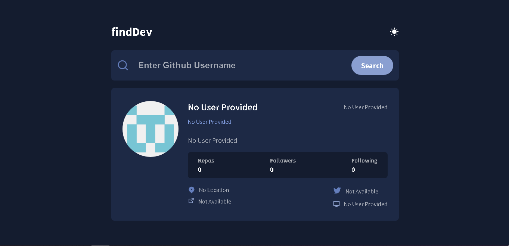

# Find Dev

Welcome to Find Dev! This is a web application that allows users to search for a GitHub account. You can find the live website [here](https://abdraoufx.github.io/Find-Dev/).

## Technologies Used

Find Dev is built using the following technologies:

- HTML
- CSS
- Vanilla JavaScript

## App Screenshot

## Features

- Search for GitHub accounts: Users can enter a GitHub username and find the corresponding GitHub account.
- Display user information: The application fetches data from the GitHub API and displays information about the user, including their profile picture, bio, number of followers, and number of repositories.

## Usage

To use Find Dev, follow these steps:

1. Visit the [live website](https://abdraoufx.github.io/Find-Dev/).
2. Enter a GitHub username in the search box.
3. Press the "Search" button or hit Enter.
4. The application will fetch the user's information and display it on the screen.

Feel free to explore different GitHub accounts and discover information about your favorite developers!

## Development

If you want to run the application locally or contribute to its development, follow these steps:

1. Clone the repository: `git clone https://github.com/abdraoufx/Find-Dev.git`.
2. Open the project in your preferred code editor.
3. Modify the code as desired.
4. Open `index.html` in your web browser to see the changes.

## Feedback and Contributions

Feedback, bug reports, and contributions are welcome! If you encounter any issues or have suggestions for improvement, please open an issue on the [GitHub repository](https://github.com/abdraoufx/Find-Dev). Feel free to submit pull requests to contribute to the project.

## License

This project is licensed under the [MIT License](LICENSE).
